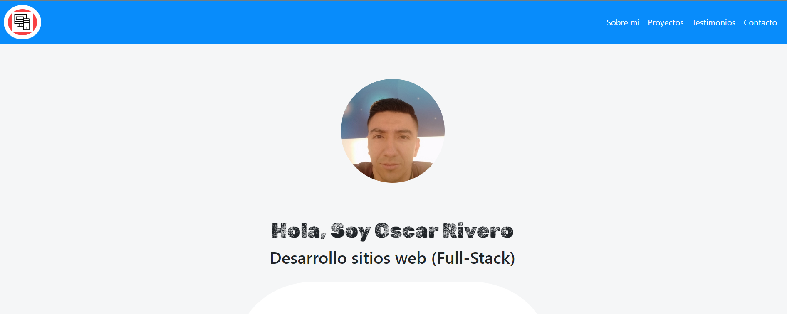
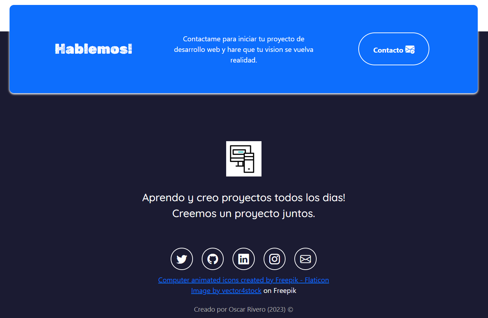

# Portafolio Personal

Este es mi portafolio personal, una página web desarrollada utilizando HTML, CSS, JavaScript y Bootstrap. En esta página, presento información sobre mí, mi experiencia, proyectos y habilidades.

## Características

- Diseño responsivo utilizando Bootstrap para asegurar una buena experiencia de usuario en dispositivos móviles y de escritorio.
- Página principal con una breve introducción y enlaces a las diferentes secciones del portafolio.
- Sección "Sobre mí" donde comparto información personal, mi formación y experiencia. Tambien donde enumero las habilidades técnicas y herramientas que utilizo asi como donde estudio los los distintos lenguajes de programacion.
- Sección "Proyectos" donde muestro algunos de los proyectos destacados que he realizado, con descripciones, capturas de pantalla y enlaces a los repositorios o sitios web       correspondientes.
- Sección "Contacto" con información para que los visitantes puedan ponerse en contacto conmigo.

## Capturas de pantalla

Aquí se presentan algunas capturas de pantalla de la página principal y las secciones principales del portafolio:

## Instalación

1. Clona este repositorio en tu máquina local: git clone https://github.com/tu-usuario/portafolio-personal.git

2. Navega a la carpeta del proyecto: cd portafolio-personal

3. Abre el archivo `index.html` en tu navegador web.

## Contribuciones

Las contribuciones son bienvenidas. Si tienes sugerencias, mejoras o correcciones, siéntete libre de enviar un pull request o abrir un issue en el repositorio.

## Recursos Ulitlizados/Derechos de Autor

Computer animated icons created by Freepik - Flaticon
Image by vector4stock on Freepik
Creado por Oscar Rivero (2023) ©

## Pagina Web en vivo

Puedes ver mi Portafolio en el siguiente enlace: [Enlace al Portafolio](https://orivero83.github.io/Portafolio_Personal/))
